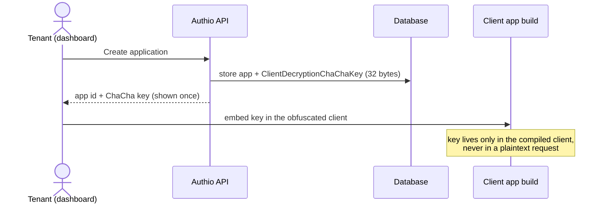
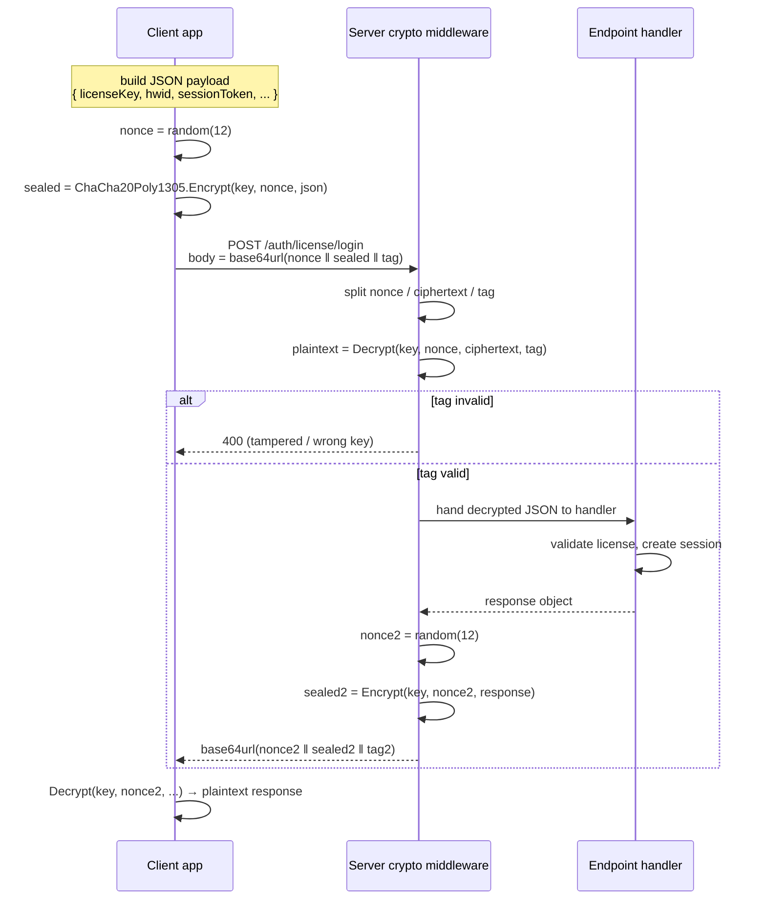
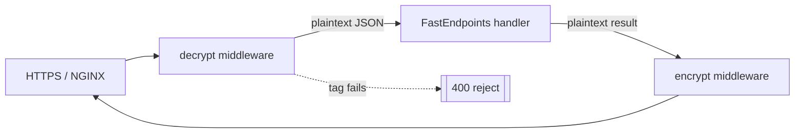
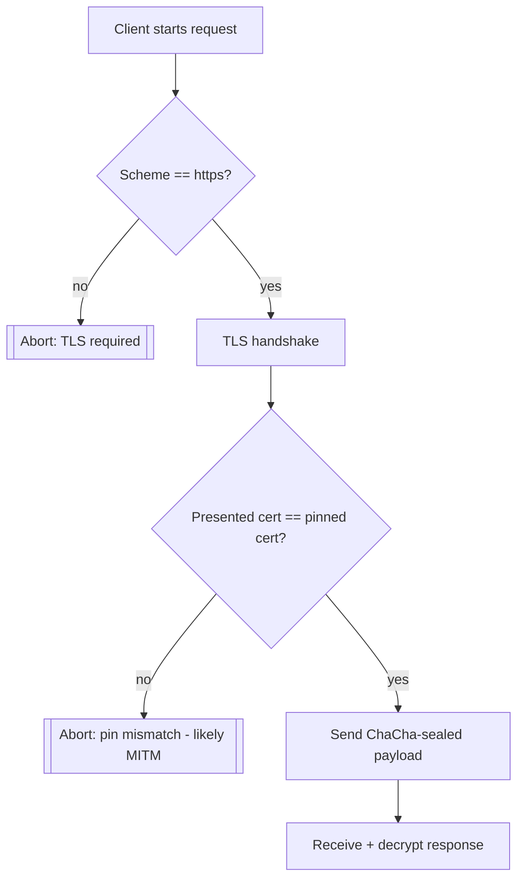

# Authio

A multi-tenant SaaS platform for secure license and session management.

This is a side project of mine in which I took my previous license authentication service and recreated it with multi-tenancy architecture. Original backend (no frontend) may be found [here](https://github.com/rllko/Multi-Tenant-Auth-Service/tree/6dd760773f648f1f214d2a4ecdfe3522a5d57eef). Contributions and pull requests are greatly appreciated!

# Development

Below is information regarding the development aspect of this project, specifically prerequisites, building and running the codebase, and contributing to it.

### Table of Contents

- [Prerequisites](#prerequisites)
  - [Web App](#web-app)
  - [Server App](#server-app)
  - [Docker](#docker)
- [Applications](#applications)
  - [Quick Start](#quick-start)
  - [First Login](#first-login)
  - [Web App](#web-app-1)
  - [Server App](#server-app-1)
  - [Migration Utility](#migration-utility)
  - [External Database (Optional)](#external-database-optional)
- [Payload Encryption (Legacy Design)](#payload-encryption-legacy-design)
- [Deployment](#deployment)
- [Contributing](#contributing)

## Prerequisites

### Web App

The web application runs on [Node.js](https://nodejs.org/) version 22.

Install the dependencies inside the `website` directory with:

```shell
npm install
```

### Server App

The server and migration utilities are written in [C#](https://learn.microsoft.com/en-us/dotnet/csharp/) and target [.NET](https://dotnet.microsoft.com/) `10.0` (see [global.json](global.json)).

### Docker

The execution of the application stack in containers will require installation of the [Docker Engine](https://docs.docker.com/engine/) with the [Docker Compose](https://docs.docker.com/compose/) plugin. It will require [PostgreSQL](https://www.postgresql.org/) and [Redis](https://redis.io/), both of which are provided in the [Docker Compose configuration.

## Applications

### Quick Start
1. Create a `.env` file using the template file `.env.example`:

   ```shell
   cp .env.example .env
   ```

2. Start everything up using Docker:

   ```shell
   docker compose up --build
   ```

For the initial run, building will be required, which can take a while. This launches the PostgreSQL, Redis, key generator, database migration tool, API server, NGINX, and website itself.

> [!NOTE]
> After applying database migrations once and exiting, the `migration` service ends execution with the following message: `migration_utility_container ... Exited (0)` which is an **expected outcome**, indicating success and not crash.

Once running, the stack is reachable at:

| Service                 | URL                                                 |
| ----------------------- | --------------------------------------------------- |
| API server (direct)     | <http://localhost:8080>                             |
| Web app / API via NGINX | <http://localhost>                                  |
| Web app (dev, direct)   | <http://localhost:3000>                             |
| PostgreSQL              | `localhost:5432` (user `postgres`, database `auth`) |

Use `docker compose up -d` to run in the background, and `docker compose down` to stop the stack. Add `-v` to also wipe the database volume and start completely fresh.

### First Login

A bootstrap admin tenant is created via database migrations for an out-of-the-box first login with:

- **Email:** `admin@authio.com`
- **Password:** `admin123`

Note that this is the owner of the seeded `test` team.

> [!WARNING]
> Change the password or remove this account before deploying to production.
### Web App

Web app is located in the `website` folder and uses [Next.js](https://nextjs.org/) along with [React](https://react.dev/) and [Tailwind CSS](https://tailwindcss.com/).

The web app includes several scripts for linting, building, and running the project. To list all available scripts execute the following command from the `website` folder:

```shell
npm run
```

In the Docker Compose stack, the web app works in the development mode ([Dockerfile.dev](website/Dockerfile.dev)) with hot reload and consumes the API via the `NEXT_PUBLIC_API_URL` environment variable.

### Server App

Server application is located in the `Server` folder. It is an ASP.NET Core application and it provides the REST API which is consumed by the web app.

The server requires a [PostgreSQL](https://www.postgresql.org/) database for persistent data and [Redis](https://redis.io/) for session state. Both are available as services in the [Docker Compose file](docker-compose.yml). The keys used by the server are generated by the `keygen` service and shared through a Docker volume.

Configuration of the server happens through environment variables (see [.env.example](.env.example)). The most important among them are `DATABASE_URL`, `DATABASE_LOGGER_URL`, and `REDIS_URL`.

### Migration Utility

Database migrations are located under the `MigrationUtility/Database/Scripts` folder. The migration utility is an independent .NET tool that applies the migrations and exits. It is executed automatically as part of the `migration` service from the Docker Compose configuration, but can also be run manually against any PostgreSQL database by specifying `DATABASE_URL`.

### External Database (Optional)

Should you choose to use the external PostgreSQL database for your Authio deployment, run the following SQL queries to configure the activity logger.


> [!WARNING]
> Don't forget to remove hardcoded credentials from production systems and set up the admin password after executing the migration.

```sql
CREATE USER authio_serilog WITH PASSWORD 'authio.24';
CREATE DATABASE activity_logs;

GRANT ALL PRIVILEGES ON DATABASE activity_logs TO authio_serilog;

\c activity_logs

GRANT SELECT, INSERT, UPDATE, DELETE ON ALL TABLES IN SCHEMA public TO authio_serilog;
GRANT USAGE, CREATE ON SCHEMA public TO authio_serilog;
```

> [!WARNING]
> Be sure to replace hardcoded credentials in production environments and set up the admin password after running the migration.

## Payload Encryption (Legacy Architecture)

This section describes the mechanism used by the original single-tenant service to protect communications between a licensed client application (e.g., a game trainer or a desktop app) and the API endpoint. It is symmetric authenticated encryption: both client and server know the same secret key and use it to encrypt and authenticate every request/response body. No entity on the network connection, including anyone who has decrypted the TLS connection using a proxy, will be able to read or modify the payload without the key.

### Why symmetric, in addition to HTTPS

HTTPS ensures the *transport* security. No more work happens once the request is out of the TLS stack: a customer can attach a debugger to their machine, set a breakpoint in the HTTP client code, and inspect or modify the plaintext that is going to be sent by the application. This is the entirety of threat model for the licensing system, where the attacker controls the client. The second, application-level symmetric encryption layer ensures that the payload bytes (the license key, the HWID, the session token) are ciphertext before even being written to the socket and the server rejects everything that does not verify.

### The cipher

Encryption is done using the **ChaCha20-Poly1305** scheme, which is an AEAD (Authenticated Encryption with Associated Data) mode implemented via [`NSec.Cryptography`](https://nsec.rocks/) library (`NSec.Cryptography` package, still used in `Server/Server.csproj`):

- **ChaCha20** is the stream cipher responsible for the encryption.
- **Poly1305** is the one-time authenticator generating a 16-byte tag; on decryption the tag is verified, and any single flipped bit renders the entire payload invalid.
- So, one AEAD mode provides both **confidentiality and integrity** in one operation.

Keys are 256-bit (32 bytes). They are generated only once in `keygen` sidecar
container on the first startup (`keygen/entrypoint.sh`) and saved to the shared secrets volume:

| Secret file          | Env var    | Purpose                                            |
| -------------------- | ---------- | -------------------------------------------------- |
| `/secrets/Chacha20`  | `CHACHA`   | Symmetric key for **payload** encrypt/decrypt      |
| `/secrets/symmetricKey` | `SYM_KEY` | HS256 key used to **sign session-token JWTs**      |

`Server/HostedServices/EnvironmentVariableService.cs` reads these keys into the process environment. In the multi-tenant version each application also has its own `ClientDecryptionChaChaKey` (`Server/Models/Entities/Application.cs`), so the payload key is scoped to the application instead of one key for all.

### Nonce discipline

ChaCha20-Poly1305 requires 96-bit (12 bytes) nonce. **Nonce+key combination cannot repeat!** The reuse discloses the keystream and breaks Poly1305 authentication. Each message contains a nonce, which is a randomly generated number. The nonce is prepended to the ciphertext so that the recipient can remove it before decryption.

```
┌────────────┬──────────────────────────────┬─────────────┐
│ nonce (12) │ ciphertext (len = plaintext) │  tag (16)   │
└────────────┴──────────────────────────────┴─────────────┘
        └──────────── all base64url-encoded on the wire ────┘
```

License keys also use base64url without padding encoding, implemented in `Guider` (`Server/Services/Guider.cs`): 16 bytes of GUID are encoded into 22 characters with `+/` replaced by `-_`.

### Provisioning the key

Before any encrypted call, the client must hold the application's ChaCha key. It is handed out once, at integration time from the dashboard, never embedded in a build in plaintext and never sent in an encrypted body (chicken-and-egg).


### Encrypted request/response cycle

After obtaining the key, all calls made will be encrypted before sending and decrypted after receiving. The session token (generated on log-in) is located inside the encrypted body and therefore not exposed regardless of TLS stripping.



### Where it sits in the middleware chain

The cryptographic layer encloses the handler: it decrypts the body prior to model binding and encrypts the body after handler execution, such that only plain DTOs can be received.



### Certificate pinning + required TLS on the client side

Encrypted payloads protect the *content* of an HTTP request; certificate pinning is responsible for protecting *who the client connects to*. In order to access the auth API, any binary must **require to**:

- **Enable TLS for all connections.** HTTP requests will be blocked out-of-the-box without allowing to fallback to `http://` protocol, to be redirected to insecure locations or to proceed after TLS handshake error.
- **Implement certificate pinning.** A hard-coded certificate of the auth server (or the public key/SPKI) is embedded in the application and the application ensures that the server has a pinned certificate. If not, the connection will be refused by the client before passing any payload data, be it encrypted or plain-text.

Why is this important for the license manager? As we now know the attacker has the control over the machine, the next step after failed extraction of the cipher will be **man-in-the-middle**
attack where one installs a root CA locally (Fiddler, mitmproxy or Charles), redirects the application to the faked authentication endpoint and tries to replay or forge authentication responses. A trusted root CA will bypass all TLS validation as OS "trusts" the certificates of the proxy.
Pinning totally ignores OS trust store and uses only one embedded certificate, which means that even "valid" MITM certificates will fail verification and will block any communications between client and server. Combined with the ChaCha payload layer this approach will prevent any traffic interception or substitution of server and client's connection to it.



> The operational overhead associated with the use of pinning is that in case of
> rotating the certificate of the server, all clients that are pinned to the old
> certificate would fail to work. This issue should be addressed via pinning of
> **public key / SPKI** (it does not change even after the certificate reissuance with the
> same key) or by offering a backup pinset.

| Attack                                     | Mitigation                                            |
| ------------------------------------------ | ----------------------------------------------------- |
| Steal secrets after TLS termination        | Body is encrypted before reaching the network socket  |
| Modify a field (for instance, modify expiry)| Poly1305 tag validation fails → request is rejected  |
| Replay a captured request                   | New nonce for each message; use session/timestamping  |
| Obtain the key from traffic                | Key is never transferred and provided out of band     |
| MITM attack with a local root CA            | Certificate pinning does not use OS trust store      |
| Downgrade/redirect to HTTP                 | Client requires HTTPS and denies any other connections |

> [!NOTE]
> It is the legacy client↔server payload schema. In the current multi-tenant implementation, the ChaCha key is provisioned per application (`ClientDecryptionChaChaKey`) but the encryption/decryption middleware is not implemented yet.

## Deployment

In order to run it in a VM, you need to upload the project to your VPS and configure the provided files in the [releases](https://github.com/rllko/Multi-Tenant-Auth-Service/releases). The `Deployment` folder includes the production `docker-compose.yml` and NGINX config. The `certbot` folder includes Let's Encrypt certificates for NGINX's HTTPS.

## Contributing

### Branches

- the [main branch](https://github.com/rllko/Multi-Tenant-Auth-Service/tree/main) is the most up-to-date
- for the development of a new feature or bugfix, a new branch should be created from the main branch

### Issues

- Features and bugs should exist as a [GitHub issue](https://github.com/rllko/Multi-Tenant-Auth-Service/issues) with an appropriate description

### Pull Requests

- To merge code into the main branch, a pull request should be opened with a description of the change
