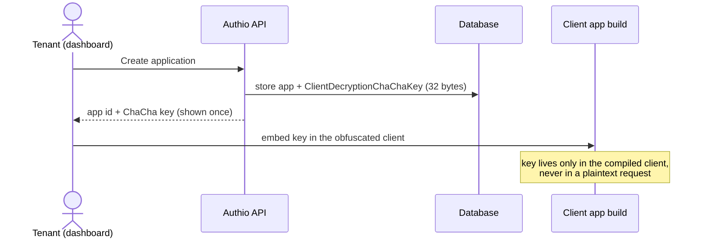
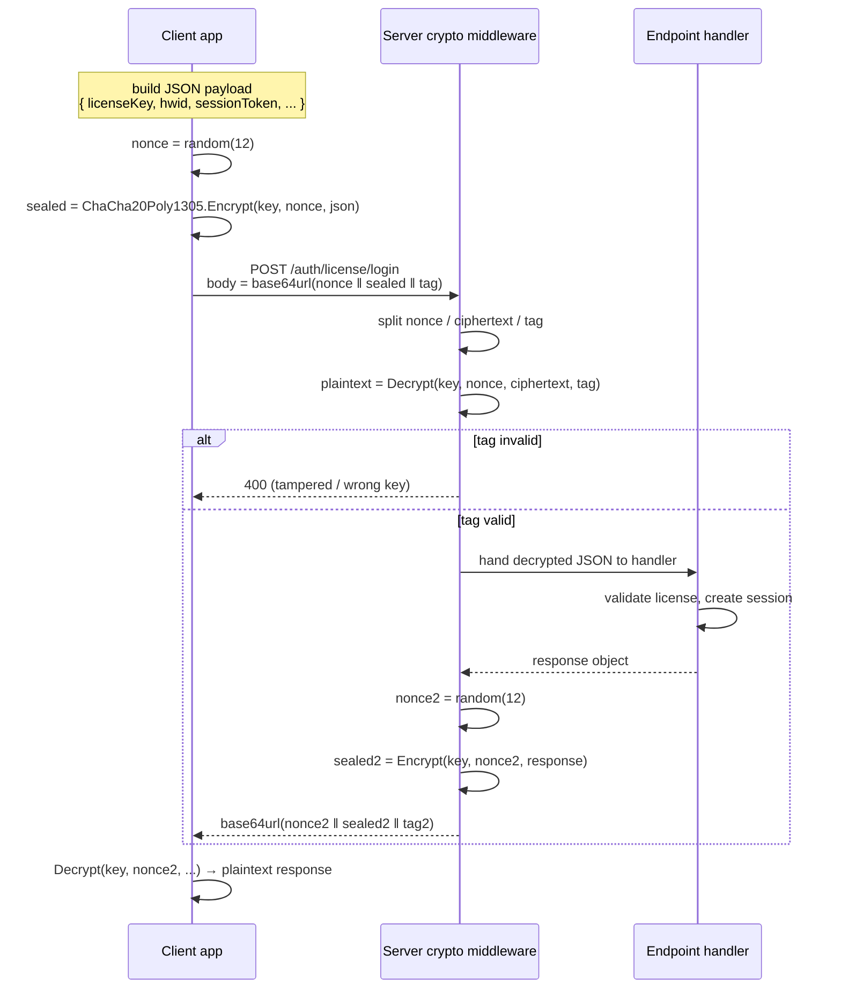
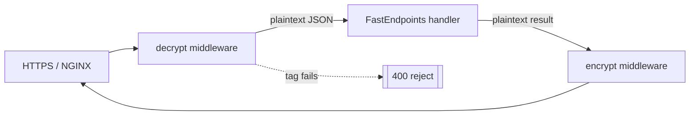
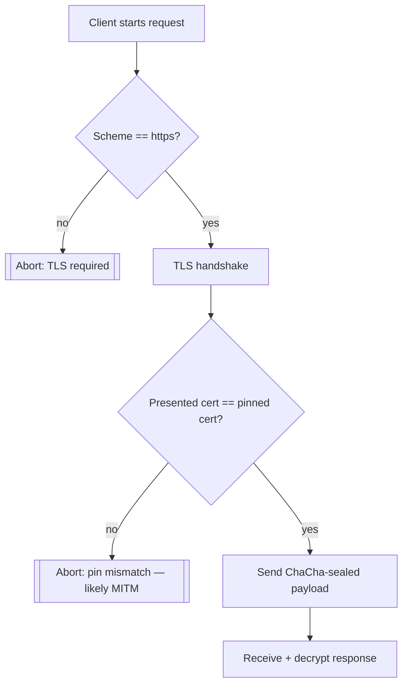

# Authio

A multi-tenant SaaS platform for secure license and session management.

This is a personal side project where I took my old license authentication system and rebuilt it with a multi-tenancy architecture. The original backend (without any frontend) can be found [here](https://github.com/rllko/Multi-Tenant-Auth-Service/tree/6dd760773f648f1f214d2a4ecdfe3522a5d57eef). Contributions and pull requests are welcome!

# Development

The following section focuses on the development part of the project, including prerequisites, how to build and run the code, and how to contribute.

### Table of Contents

- [Prerequisites](#prerequisites)
  - [Web App](#web-app)
  - [Server App](#server-app)
  - [Docker](#docker)
- [Applications](#applications)
  - [Quick Start](#quick-start)
  - [First Login](#first-login)
  - [Web App](#web-app-1)
  - [Server App](#server-app-1)
  - [Migration Utility](#migration-utility)
  - [External Database (Optional)](#external-database-optional)
- [Payload Encryption (Legacy Design)](#payload-encryption-legacy-design)
- [Deployment](#deployment)
- [Contributing](#contributing)

## Prerequisites

### Web App

The web application runs on [Node.js](https://nodejs.org/) version 22.

Install the dependencies inside the `website` directory with:

```shell
npm install
```

### Server App

The server and migration utility are written in [C#](https://learn.microsoft.com/en-us/dotnet/csharp/) and target [.NET](https://dotnet.microsoft.com/) `10.0` (see [global.json](global.json)).

### Docker

To run the application stack in containers, the [Docker Engine](https://docs.docker.com/engine/) with the [Docker Compose](https://docs.docker.com/compose/) plugin is expected to be installed. The stack requires [PostgreSQL](https://www.postgresql.org/) and [Redis](https://redis.io/), both of which are already included in the [Docker Compose file](docker-compose.yml) along with NGINX.

## Applications

### Quick Start

1. Create a `.env` file based on the provided `.env.example`:

   ```shell
   cp .env.example .env
   ```

1. Build and run the whole stack with Docker:

   ```shell
   docker compose up --build
   ```

The first run builds the images and may take a few minutes. This starts PostgreSQL, Redis, the key generator, the database migration utility, the API server, NGINX, and the web app.

> [!NOTE]
> The `migration` service applies the database migrations once and then exits — a `migration_utility_c ... Exited (0)` status is **expected** and means it succeeded, not that it crashed.

Once running, the stack is reachable at:

| Service                 | URL                                                 |
| ----------------------- | --------------------------------------------------- |
| API server (direct)     | <http://localhost:8080>                             |
| Web app / API via NGINX | <http://localhost>                                  |
| Web app (dev, direct)   | <http://localhost:3000>                             |
| PostgreSQL              | `localhost:5432` (user `postgres`, database `auth`) |

Use `docker compose up -d` to run in the background, and `docker compose down` to stop the stack — add `-v` to also wipe the database volume and start completely fresh.

### First Login

The database migrations seed a bootstrap admin tenant so you can log in out-of-the-box:

- **Email:** `admin@authio.com`
- **Password:** `admin123`

This account is the Team Owner of the seeded `test` team.

> [!WARNING]
> Change the password or remove this account before deploying to production.

### Web App

The web application can be found in the `website` directory. It uses [Next.js](https://nextjs.org/) with [React](https://react.dev/) and [Tailwind CSS](https://tailwindcss.com/).

The web application contains several scripts to lint, build and run the project. To check the available scripts, run the following command inside the `website` directory:

```shell
npm run
```

In the Docker Compose stack, the web app runs in development mode ([Dockerfile.dev](website/Dockerfile.dev)) with hot reload, and talks to the API through the `NEXT_PUBLIC_API_URL` environment variable.

### Server App

The server application can be found in the `Server` directory. It is an ASP.NET Core application that serves the REST API consumed by the web app.

The server requires a [PostgreSQL](https://www.postgresql.org/) database for persistent data and [Redis](https://redis.io/) for session state. Both are available as services in the [Docker Compose file](docker-compose.yml). The keys used by the server are generated by the `keygen` service and shared through a Docker volume.

The server is configured through environment variables (see [.env.example](.env.example)), most importantly `DATABASE_URL`, `DATABASE_LOGGER_URL`, and `REDIS_URL`.

### Migration Utility

The database migrations can be found in the `MigrationUtility/Database/Scripts` directory. The migration utility is a standalone .NET application that applies the migrations and exits; it runs automatically as the `migration` service in the Docker Compose stack, and can also be run manually against any PostgreSQL instance by setting `DATABASE_URL`.

### External Database (Optional)

If you prefer running Authio with an external PostgreSQL database, execute the following SQL commands to set up the activity logger:

```sql
CREATE USER authio_serilog WITH PASSWORD 'authio.24';
CREATE DATABASE activity_logs;

GRANT ALL PRIVILEGES ON DATABASE activity_logs TO authio_serilog;

\c activity_logs

GRANT SELECT, INSERT, UPDATE, DELETE ON ALL TABLES IN SCHEMA public TO authio_serilog;
GRANT USAGE, CREATE ON SCHEMA public TO authio_serilog;
```

> [!WARNING]
> Be sure to replace hardcoded credentials in production environments and set up the admin password after running the migration.

## Payload Encryption (Legacy Design)

This section documents how the original single-tenant service protected traffic
between a licensed client application (for example a game trainer or a desktop
app) and the API. The scheme is **symmetric authenticated encryption**: the
client and the server share a secret key and every request/response body is
encrypted and authenticated with it. Nobody on the wire — not even someone who
already terminated TLS at a proxy — can read or tamper with a payload without the
key.

### Why symmetric, on top of HTTPS

HTTPS secures the *transport*. It does nothing once the request leaves the TLS
layer: a customer can attach a debugger to their own machine, set a breakpoint in
the HTTP client, and read or rewrite the plaintext the app is about to send. For
a licensing system that is the whole threat model — the attacker owns the client.
A second, application-level symmetric layer means the useful bytes (the license
key, the HWID, the session token) are ciphertext *before* they ever touch the
socket, and the server refuses anything whose authentication tag does not verify.

### The cipher

Encryption uses **ChaCha20-Poly1305**, an AEAD (Authenticated Encryption with
Associated Data) construction, via [`NSec.Cryptography`](https://nsec.rocks/)
(`NSec.Cryptography` package, still referenced in `Server/Server.csproj`).

- **ChaCha20** is the stream cipher that produces the ciphertext.
- **Poly1305** is the one-time authenticator that produces a 16-byte tag. The tag
  is verified on decrypt; a single flipped bit makes the whole payload fail.
- One AEAD operation therefore gives **confidentiality + integrity** in a single
  pass — there is no separate HMAC step.

Keys are 256-bit (32 bytes). They are minted once by the `keygen` sidecar
container at first boot (`keygen/entrypoint.sh`) and written to a shared secrets
volume:

| Secret file          | Env var    | Purpose                                            |
| -------------------- | ---------- | -------------------------------------------------- |
| `/secrets/Chacha20`  | `CHACHA`   | Symmetric key for **payload** encrypt/decrypt      |
| `/secrets/symmetricKey` | `SYM_KEY` | HS256 key used to **sign session-token JWTs**      |

`Server/HostedServices/EnvironmentVariableService.cs` loads these into the
process environment at startup. In the multi-tenant rewrite each application also
carries its own `ClientDecryptionChaChaKey`
(`Server/Models/Entities/Application.cs`), so the payload key can be scoped
per-application instead of one global key.

### Nonce discipline

ChaCha20-Poly1305 uses a 96-bit (12-byte) nonce. **A key + nonce pair must never
repeat** — reuse leaks the keystream and breaks Poly1305. Every message carries a
fresh random nonce, prepended to the ciphertext so the receiver can strip it back
off before decrypting:

```
┌────────────┬──────────────────────────────┬─────────────┐
│ nonce (12) │ ciphertext (len = plaintext) │  tag (16)   │
└────────────┴──────────────────────────────┴─────────────┘
        └──────────── all base64url-encoded on the wire ────┘
```

License keys use the same base64url-without-padding encoding, handled by
`Guider` (`Server/Services/Guider.cs`): a 16-byte GUID becomes a 22-char string
with `+/` mapped to `-_`, which is what the customer sees and pastes into the app.

### Provisioning the key

Before any encrypted call, the client must hold the application's ChaCha key. It
is handed out once, at integration time, from the dashboard — never embedded in a
build in plaintext and never sent in an encrypted body (chicken-and-egg).



### Encrypted request/response cycle

Once the client has the key, every call is sealed on the way out and opened on
the way in. The session token (issued at sign-in) travels *inside* the encrypted
body, so it is never exposed even if TLS is stripped.



### Where it sits in the middleware chain

The crypto layer wraps the handler: it decrypts inbound bodies before model
binding and encrypts outbound bodies after the handler returns, so endpoint code
only ever sees plaintext DTOs.



### Certificate pinning + enforced TLS on the client

The encrypted payload protects the *contents* of a request; certificate pinning
protects *who the client will talk to at all*. Any executable that interacts with
the auth API is **required** to:

- **Enforce TLS on every connection.** Plain-HTTP is refused outright — the
  client never falls back to `http://`, never follows a redirect off HTTPS, and
  aborts if the handshake does not complete.
- **Pin the auth server's certificate.** The client ships with the expected
  server certificate (or its public-key hash / SPKI) baked in and compares it
  against what the server presents during the handshake. If the presented
  certificate is not the pinned one, the connection is dropped **before** any
  payload — encrypted or not — is sent.

Why this matters for a licensing system: the attacker owns the machine, so the
usual next step after failing to read the ciphertext is to **man-in-the-middle
themselves** — install a local root CA (Fiddler, mitmproxy, Charles), point the
app at a fake endpoint, and try to replay or forge auth responses. A trusted
local root defeats ordinary TLS validation because the OS now "trusts" the
proxy's cert. Pinning ignores the OS trust store entirely: only the one embedded
certificate is accepted, so a self-signed MITM cert — even a "valid" one — fails
the check and the client stops talking. Combined with the ChaCha payload layer,
an attacker cannot read traffic, cannot substitute the server, and cannot get the
client to emit anything to an endpoint it does not recognise.



> Pinning has an operational cost: when the server certificate rotates, clients
> pinned to the old one break. Mitigate by pinning the **public key / SPKI**
> (survives reissue with the same key) or by shipping a small backup pin set, and
> by rotating on a schedule the client build cadence can keep up with.

### Threat coverage at a glance

| Attack                                   | Mitigation                                             |
| ---------------------------------------- | ------------------------------------------------------ |
| Read secrets after TLS termination       | Body is ciphertext before it hits the socket           |
| Tamper with a field (e.g. bump expiry)   | Poly1305 tag verification fails → request rejected     |
| Replay a captured request                | Fresh per-message nonce; pair with a session/timestamp |
| Extract the key from traffic             | Key is never transmitted; provisioned out of band      |
| MITM with a locally-trusted root CA      | Certificate pinning ignores the OS trust store         |
| Downgrade / redirect to plain HTTP       | Client enforces TLS and refuses non-HTTPS connections  |

> [!NOTE]
> This describes the legacy client↔server payload scheme. In the current
> multi-tenant codebase the ChaCha key is provisioned per application
> (`ClientDecryptionChaChaKey`) but the encrypt/decrypt middleware is not yet
> wired end-to-end — see `LICENSE_INTEGRATION_PLAN.md` for where it lands.

## Deployment

To run this on a VM, upload the project to your VPS and configure the files provided in the [releases](https://github.com/rllko/Multi-Tenant-Auth-Service/releases). The `Deployment` directory contains the production Docker Compose file and NGINX configuration, and the `certbot` directory holds the [Let's Encrypt](https://letsencrypt.org/) certificates used by NGINX for HTTPS.

## Contributing

### Branches

- The [main branch](https://github.com/rllko/Multi-Tenant-Auth-Service/tree/main) contains the latest code
- To develop a new feature or fix a bug, a new branch should be created based on the main branch

### Issues

- Features and bugs should exist as a [GitHub issue](https://github.com/rllko/Multi-Tenant-Auth-Service/issues) with an appropriate description

### Pull Requests

- To merge code into the main branch, a pull request should be opened with a description of the change
